# PicoClaw Swarm Mode Architecture

## Overview

PicoClaw Swarm Mode enables multiple PicoClaw instances to work together as a distributed system, providing:
- **Node Discovery**: Automatic peer discovery via NATS JetStream KV with TTL-based liveness
- **Health Monitoring**: Heartbeat renewal with configurable TTL and failure detection
- **Load Balancing**: Intelligent task distribution based on node load scoring
- **Handoff Mechanism**: Dynamic task delegation via NATS request-reply
- **Leader Election**: Distributed leader election via KV CAS (Compare-And-Swap) lock

**Transport**: All swarm communication uses NATS as the sole transport layer. There is no UDP gossip, no custom RPC, and no unencrypted channels.

## Architecture

```
┌─────────────────────────────────────────────────────────────────┐
│                        PicoClaw Swarm                           │
│                     (NATS as sole transport)                    │
├─────────────────────────────────────────────────────────────────┤
│  Control Plane                   │  Data Plane                  │
│  ├─ Node Discovery (KV + TTL)   │  ├─ Task Execution           │
│  ├─ Membership Management       │  ├─ Session Transfer          │
│  ├─ Health Monitoring            │  │   (NATS request-reply)     │
│  ├─ Load Monitoring              │  └─ Message Routing           │
│  └─ Leader Election (KV CAS)    │      (targeted subjects)      │
└─────────────────────────────────────────────────────────────────┘
```

## NATS Subject Namespace

All swarm messages are published under a common subject prefix. NATS ACL rules should restrict `picoclaw.swarm.>` to authenticated swarm node identities only.

| Subject Pattern | Purpose |
|-----------------|---------|
| `picoclaw.swarm.heartbeat.<nodeID>` | Heartbeat / KV renewal |
| `picoclaw.swarm.node.<nodeID>.msg` | Direct node messaging (request-reply) |
| `picoclaw.swarm.handoff.<nodeID>` | Targeted handoff requests (request-reply) |
| `picoclaw.swarm.leader` | Leader election announcements |
| `picoclaw.swarm.metrics.<nodeID>` | Metrics publishing |

## JetStream KV Buckets

| Bucket | Key Pattern | TTL | Purpose |
|--------|-------------|-----|---------|
| `swarm_members` | `node.<nodeID>` | 15s (configurable) | Membership liveness via TTL expiry |
| `swarm_status` | `status.<nodeID>` | 30s | Detailed node status cache (CPU, mem, tasks) |
| `swarm_leader` | `leader` | 10s | Leader election CAS lock |

## Control Plane

### 1. Node Discovery

Nodes discover each other by writing entries to the `swarm_members` KV bucket and watching for changes. Liveness is determined by TTL — if a node stops renewing its entry, the key expires and the node is considered dead.

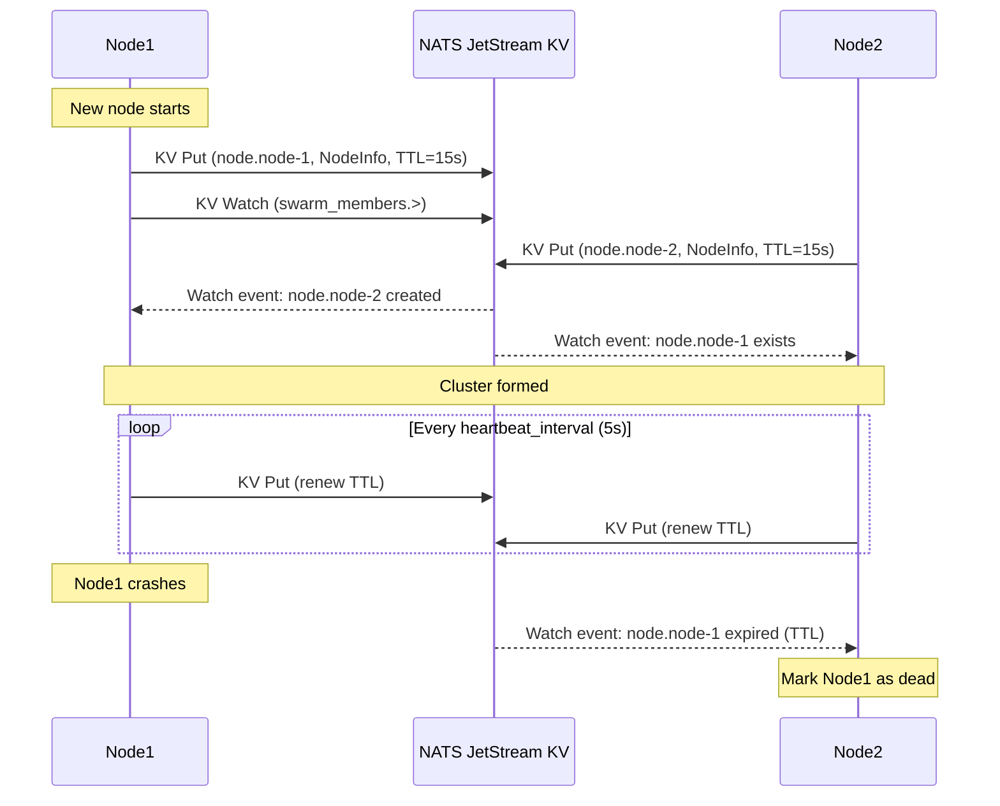

**Key Parameters:**

| Parameter | Default | Description |
|-----------|---------|-------------|
| `heartbeat_interval` | 5s | Frequency of KV entry renewal |
| `member_ttl` | 15s | TTL for member entries (must be > heartbeat_interval) |
| `node_timeout` | 5s | Time before marking node as suspect |
| `dead_node_timeout` | 30s | Time before removing dead node from view |

### 2. Membership Management

Each node maintains a local `ClusterView` populated by KV watch events:

```go
type ClusterView struct {
    sync.RWMutex
    localNode  *NodeInfo
    members    map[string]*NodeWithState  // node_id -> NodeWithState
    Size       int
}
```

**Node State Machine:**

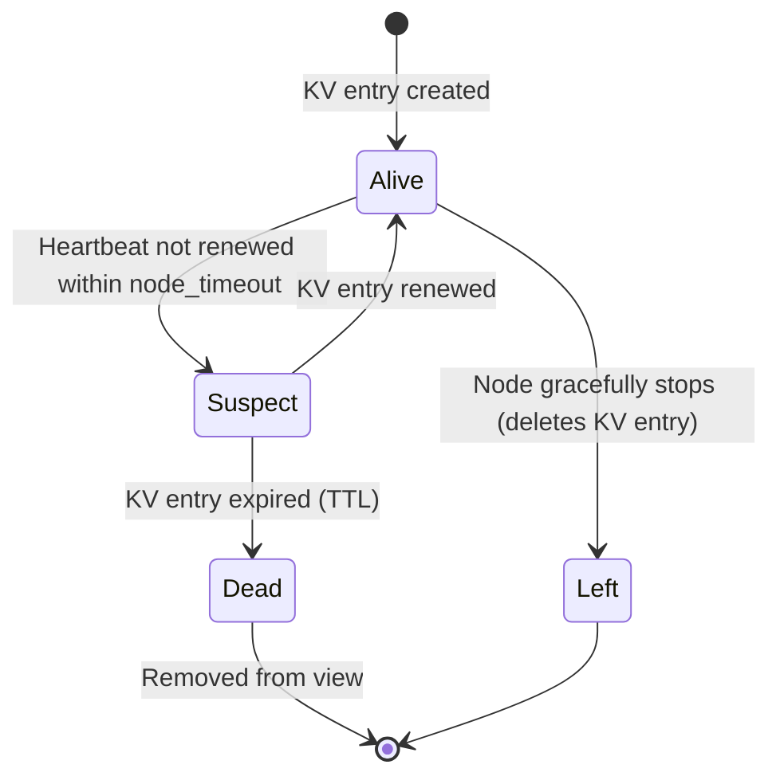

**Node Information:**

```go
type NodeInfo struct {
    ID        string            // Unique node identifier
    Addr      string            // IP address
    Port      int               // Service port
    AgentCaps map[string]string // Capabilities (models, tools)
    LoadScore float64           // Current load (0.0-1.0)
    Labels    map[string]string // Custom labels
    Timestamp int64             // Last update time (UnixNano)
    Version   string            // Protocol version
}
```

### 3. Health Monitoring

Health is driven by KV TTL — no separate probe/ping mechanism is needed:

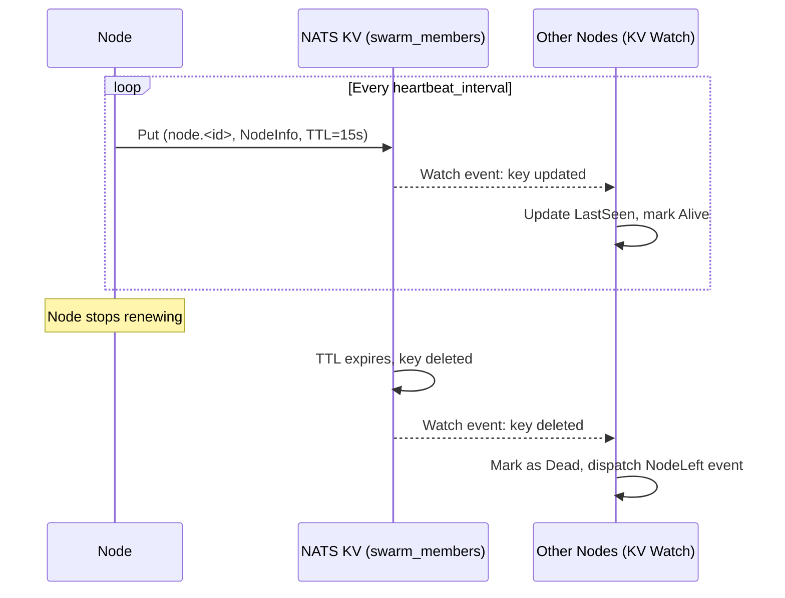

### 4. Load Monitoring

Each node continuously monitors its resource usage (transport-agnostic):

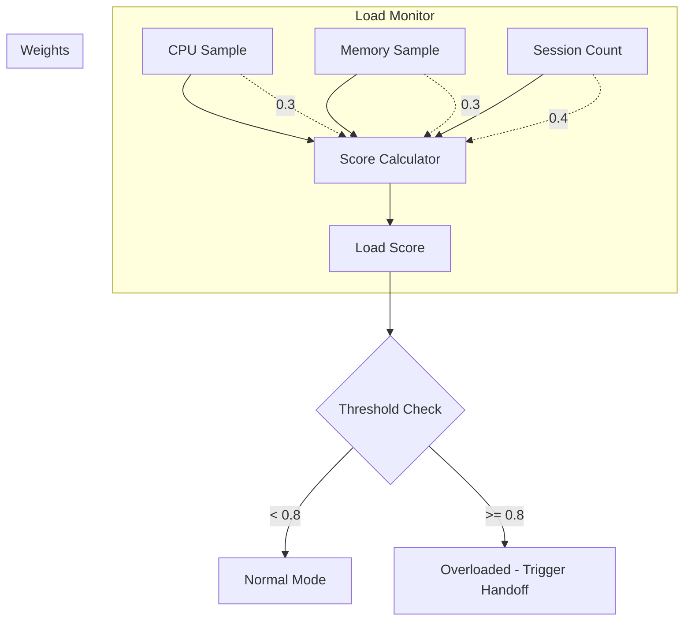

**Load Score Formula:**

```
LoadScore = (CPUUsage * cpu_weight) +
            (MemoryUsage * memory_weight) +
            (SessionRatio * session_weight)

Where:
- CPUUsage = current CPU usage (0.0-1.0)
- MemoryUsage = current memory usage (0.0-1.0)
- SessionRatio = current_sessions / max_sessions
- Default weights: cpu=0.3, memory=0.3, session=0.4
```

### 5. Leader Election

Leader election uses a CAS (Compare-And-Swap) lock on the `swarm_leader` KV bucket:

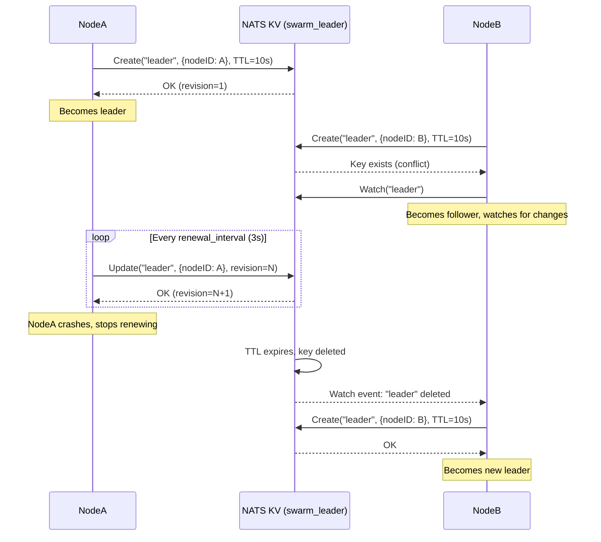

## Data Plane

### 1. Request Routing

Inter-node messages use NATS request-reply on targeted subjects:

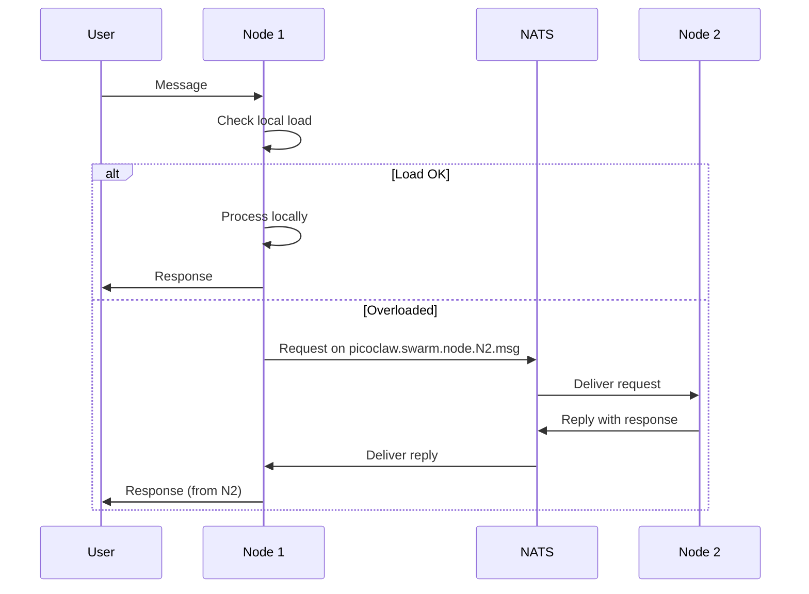

### 2. Handoff Mechanism

**Handoff Decision Flow:**

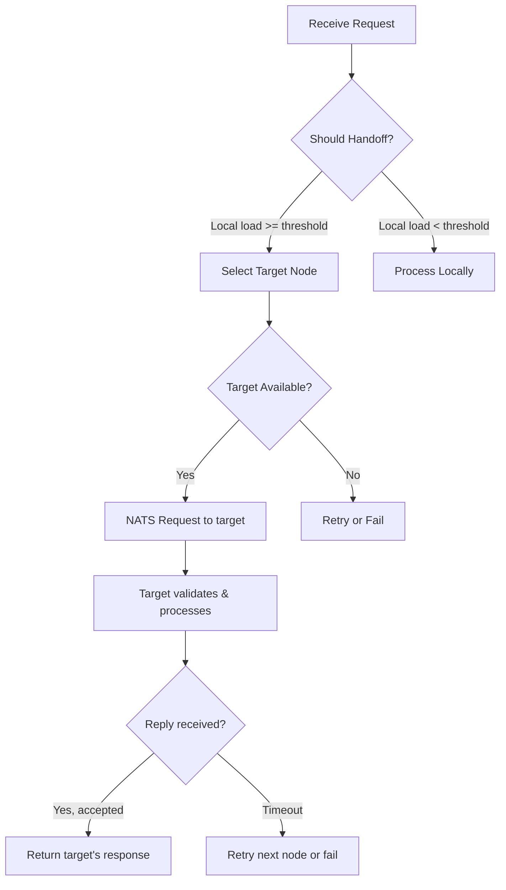

**Handoff Protocol (NATS request-reply):**

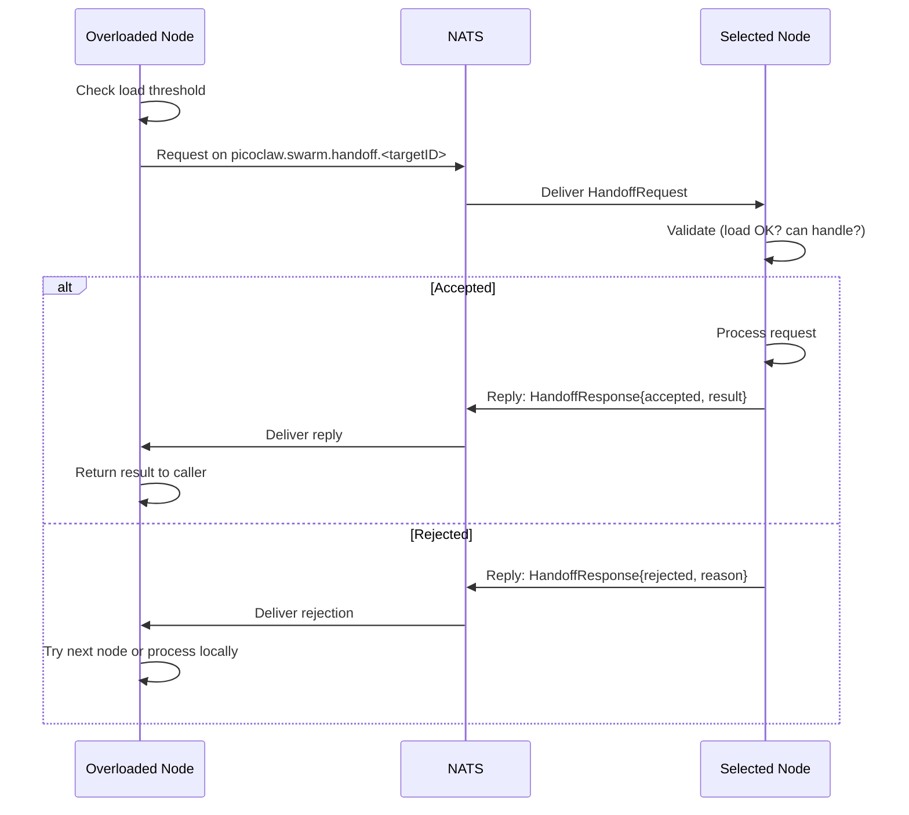

### 3. Direct Node Messaging

Nodes can send arbitrary messages to specific peers using NATS request-reply:

```
Subject: picoclaw.swarm.node.<targetNodeID>.msg
Payload: JSON {action, message, channel, chat_id, sender_id, trace_id}
Reply:   JSON {response} or {error}
```

Context parameters (`channel`, `chat_id`, `sender_id`, `trace_id`) enable cross-node audit trails and conversation continuity.

## System Architecture

### Component Overview

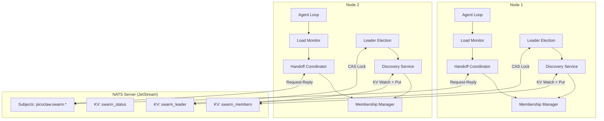

### Communication Channels

| Channel | Protocol | Purpose |
|---------|----------|---------|
| Discovery | NATS KV (JetStream) | Membership liveness via TTL |
| Status Cache | NATS KV (JetStream) | Detailed node status (CPU, mem, tasks) |
| Leader Election | NATS KV CAS (JetStream) | Distributed leader lock |
| Handoff | NATS request-reply | Session transfer coordination |
| Node Messaging | NATS request-reply | Direct inter-node messages |
| Metrics | NATS publish | Observability data |

## Configuration

### Example Configuration

```json
{
  "swarm": {
    "enabled": true,
    "node_id": "picoclaw-node-1",

    "discovery": {
      "nats_url": "nats://nats.example.com:4222",
      "nats_creds_file": "/etc/picoclaw/nats.creds",
      "nats_tls_cert": "/etc/picoclaw/client-cert.pem",
      "nats_tls_key": "/etc/picoclaw/client-key.pem",
      "nats_tls_ca_cert": "/etc/picoclaw/ca.pem",
      "heartbeat_interval": "5s",
      "member_ttl": "15s",
      "node_timeout": "5s",
      "dead_node_timeout": "30s"
    },

    "handoff": {
      "enabled": true,
      "load_threshold": 0.8,
      "timeout": "30s",
      "max_retries": 3,
      "retry_delay": "5s",
      "request_timeout": "10s"
    },

    "load_monitor": {
      "enabled": true,
      "interval": "5s",
      "sample_size": 60,
      "cpu_weight": 0.3,
      "memory_weight": 0.3,
      "session_weight": 0.4
    },

    "leader_election": {
      "enabled": false,
      "lock_ttl": "10s",
      "renewal_interval": "3s"
    }
  }
}
```

### Minimal Two-Node Setup

**1. Start NATS with JetStream:**

```bash
docker run -d --name nats \
  -p 4222:4222 \
  nats:latest -js
```

**2. Node 1 config (`node1.json`):**

```json
{
  "swarm": {
    "enabled": true,
    "node_id": "node-1",
    "discovery": {
      "nats_url": "nats://localhost:4222"
    }
  }
}
```

**3. Node 2 config (`node2.json`):**

```json
{
  "swarm": {
    "enabled": true,
    "node_id": "node-2",
    "discovery": {
      "nats_url": "nats://localhost:4222"
    }
  }
}
```

**4. Verify cluster:**

Once both nodes start, each should discover the other via KV watch within one `heartbeat_interval` (5s). Use the `swarm_nodes` tool or `/nodes` command to verify membership.

### Deployment Modes

**Single Entry Point:**

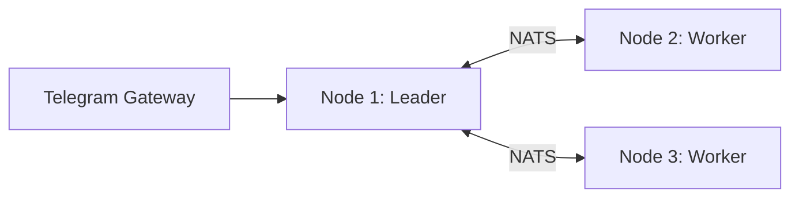

**Multi-Entry Point (with load balancer):**

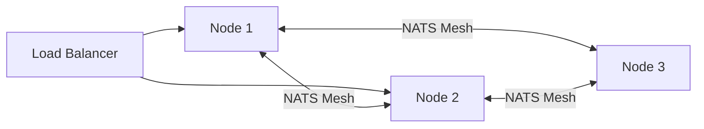

## Event System

The swarm publishes events for monitoring and integration:

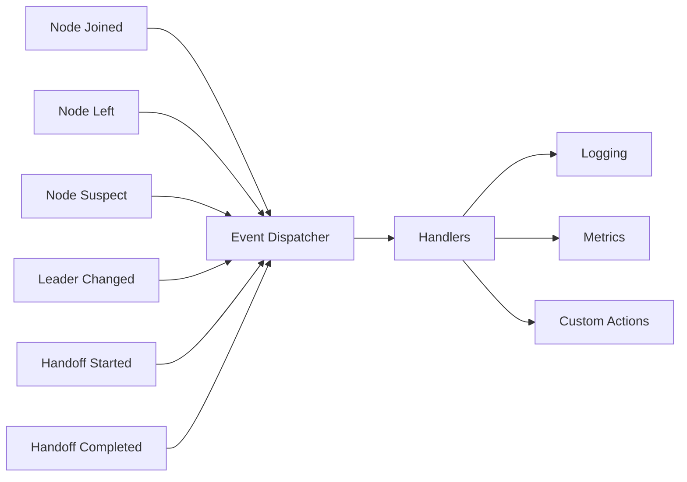

**Event Types:**

| Event | Description | Payload |
|-------|-------------|---------|
| `NodeJoined` | New node discovered via KV watch | NodeInfo |
| `NodeLeft` | Node KV entry expired or deleted | NodeID |
| `NodeSuspect` | Node heartbeat overdue | NodeID |
| `NodeAlive` | Node recovered (KV entry renewed) | NodeInfo |
| `LeaderChanged` | Leader election result changed | LeaderID |
| `HandoffStarted` | Handoff initiated | HandoffOperation |
| `HandoffCompleted` | Handoff finished | HandoffResult |
| `HandoffFailed` | Handoff error | Error |

## Error Handling

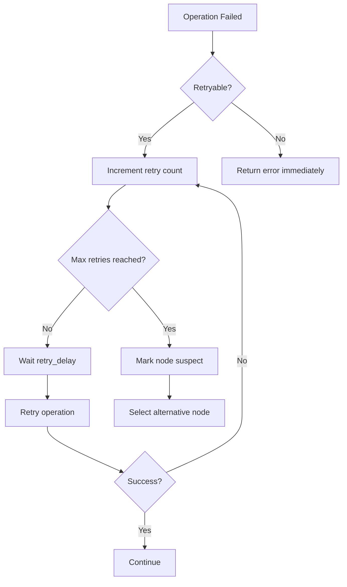

## Security

### Threat Model

PicoClaw Swarm assumes nodes are deployed in a **trusted or semi-trusted network**. The NATS server is the single trust boundary.

| Concern | Mitigation |
|---------|------------|
| **Transport encryption** | NATS TLS (configure `nats_tls_*` options) |
| **Node authentication** | NATS credentials file (NKeys/JWT) or mTLS client certs |
| **Subject authorization** | NATS ACL: restrict `picoclaw.swarm.>` to swarm node identities |
| **Inter-node message integrity** | NATS connection-level TLS ensures no tampering |
| **Unauthorized KV access** | JetStream permissions: only swarm nodes can read/write swarm KV buckets |

### Production Recommendations

1. **Always enable TLS** — set `nats_tls_cert`, `nats_tls_key`, `nats_tls_ca_cert`
2. **Use NKeys or JWT credentials** — set `nats_creds_file` for per-node identity
3. **Configure NATS ACLs** — restrict `picoclaw.swarm.>` publish/subscribe to swarm accounts
4. **Network isolation** — NATS port (4222) should not be exposed to public internet
5. **Rotate credentials** — use short-lived JWTs with NATS account server for production

### Minimal Secure NATS Configuration

```conf
# nats-server.conf
listen: 0.0.0.0:4222
jetstream: enabled

tls {
  cert_file: "/etc/nats/server-cert.pem"
  key_file:  "/etc/nats/server-key.pem"
  ca_file:   "/etc/nats/ca.pem"
  verify:    true  # require client certs (mTLS)
}

authorization {
  swarm_user = {
    publish = ["picoclaw.swarm.>", "$JS.API.>"]
    subscribe = ["picoclaw.swarm.>", "_INBOX.>"]
  }
  users = [
    { nkey: "UABC...", permissions: $swarm_user }
  ]
}
```

## Future Enhancements

1. **Consistent Hashing**: Route requests to stable node assignments for session affinity
2. **Multi-Region**: Geo-distributed clusters with region-aware subject prefixes
3. **Graceful Draining**: Leader-coordinated node shutdown with session migration
4. **Observability**: Prometheus metrics endpoint for swarm health (connection count, handoff latency, leader changes)
